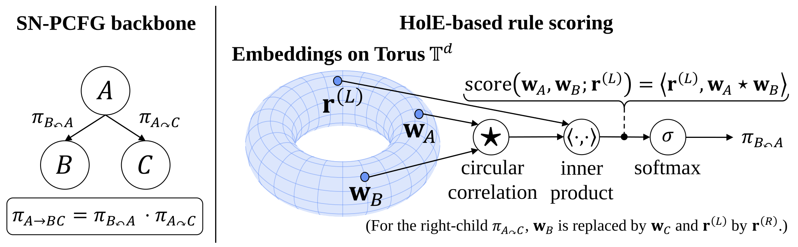

# Holographic Neural PCFG

**Holographic Neural PCFG (Hol-PCFG)** for unsupervised constituency parsing.



This repository is a fork of the TN-PCFG / NBL-PCFG / SimplePCFG [code base](https://github.com/sustcsonglin/TN-PCFG).
On top of the upstream PCFG family it adds the **Hol-PCFG** models and a large in-house experiment program.

### Fork contributions

| Model | `model_name` | Class | Notes |
|-------|--------------|-------|-------|
| **Hol-PCFG** | `HNPCFG` | `parser/model/HN_PCFG.py` | Holographic Neural PCFG with independent left/right productions (circular-correlation rule scoring on a high-dimensional torus). |

Built on the upstream **SimplePCFG** (`SNPCFG`/`SCPCFG`) inference in
`parser/pcfgs/simple_pcfg.py` and the fused log-semiring CKY triton kernels in
`parser/triton/fn.py` (shared by the SimplePCFG and TN-PCFG inside/decode).

The fork also integrates **SemInfo** training (Chen et al., ICLR 2025) via the
vendored `parsing_by_maxseminfo/` package, kept intentionally separate from
`parser/` so its published numbers reproduce exactly. See
[`parsing_by_maxseminfo/LOCAL_PATCHES.md`](parsing_by_maxseminfo/LOCAL_PATCHES.md)
for what is vendored and why.

### Upstream baselines (retained, selectable via `model_name`)

`NPCFG` (N-PCFG), `CPCFG` (Compound PCFG), `TNPCFG`/`FastTNPCFG` (TN-PCFG),
`NBLPCFG`/`FastNBLPCFG` (Neural Bi-Lexicalized PCFG), `NLPCFG` (Neural L-PCFG),
`SNPCFG`/`SCPCFG` (SimplePCFG). See [`THIRD_PARTY_NOTICES.md`](THIRD_PARTY_NOTICES.md) for the papers.

---

## Repository layout

```
parser/                 core package (the library)
  model/                model definitions; model_name -> class via helper/util.py:get_model
  pcfgs/                inside algorithm / decoding (simple_pcfg, tdpcfg, blpcfg, lpcfg, ...)
  triton/fn.py          fused log-semiring CKY triton kernels (shared by simple_pcfg.py / tdpcfg.py)
  helper/               data_module (data loading), metric (UF1/UAS), util (get_model/optimizer)
  cmds/                 Train / Evaluate loops
config/                 experiment configs grouped by family (see config/README.md)
  seminfo/              SemInfo configs (Chen-et-al schema; run via parsing_by_maxseminfo)
scripts/                reusable tooling: data prep, training launchers, Optuna, analysis
                        (see scripts/README.md)
  seminfo/              SemInfo launchers / Optuna / repro + seeded-train wrapper
archive/                frozen, one-off experiment scripts/configs (see archive/README.md)
docs/                   collaborator guides (see docs/adding-a-model.md)
tests/                  pytest unit + integration tests
docker/                 Dockerfile, entrypoint, container requirements.txt
fastNLP/                vendored third-party library (see fastNLP/LOCAL_PATCHES.md) -- NOT first-party
parsing_by_maxseminfo/  vendored SemInfo training harness (see its LOCAL_PATCHES.md) -- NOT first-party core
train.py / evaluate.py / preprocessing.py   top-level entry points
data/  log/  logs/  results/  runs/  wandb/  -- gitignored, regenerated per clone
```

`model_name` (a string in each config's `model:` block) is the single dispatch key. The
mapping lives in `parser/helper/util.py:get_model`.

---

## Setup (Docker — supported path)

The project runs in a CUDA container based on `nvcr.io/nvidia/pytorch:25.01-py3`
(torch / triton / CUDA come from the base image; `docker/requirements.txt` adds the rest).

```bash
cp .env.example .env          # then set WORKSPACE_DIR (see below)
docker compose up -d --build
docker exec -it holpcfg bash   # container name = $CONTAINER_NAME in .env
```

### `.env`

`.env` is gitignored; `cp .env.example .env` lists every key `docker-compose.yml`
needs, with working defaults for all but one:

- `WORKSPACE_DIR` — host path mounted to `/workspace/<PROJECT_NAME>` (`PROJECT_NAME`
  defaults to `hol-pcfg`). It backs a bind mount, so an empty value breaks
  `docker compose up`.

Other commonly-edited keys: `HOST_UID` / `HOST_GID` (match your host user for file
ownership), `CONTAINER_NAME` / `IMAGE_NAME` (default `holpcfg`),
`WANDB_API_KEY` (only if you log to Weights & Biases — `wandb.enabled: true` in
configs), and `OPENAI_API_KEY` (only for the SemInfo paraphrase preprocessing).
Both API keys are optional.

Optional in-container developer tooling (Claude Code / Codex / Notion MCP / SSH +
gh) is kept out of the research image. To enable it, copy
`docker-compose.override.example.yml` to `docker-compose.override.yml` (gitignored,
auto-merged by Compose) and follow the usage notes in its header.

---

## Data

`data/` is gitignored — each clone regenerates it.

- **PTB / CTB / SPMRL** preprocessed pickles: download from the upstream
  [Google Drive](https://drive.google.com/file/d/1npIpF9y61KBa-Ki7JgyyzK1cFpKl67Ls/view?usp=sharing),
  or build PTB pickles from bracketed trees with `preprocessing.py`:
  ```bash
  python preprocessing.py \
    --train_file path/to/train.txt --val_file path/to/valid.txt --test_file path/to/test.txt \
    --cache_path data/clean/english-
  ```
  The lexicalized `NLPCFG` / `NBLPCFG` baselines use the separate head-annotated
  `data/ptb-{train,val,test}-lpcfg.pickle` files from the upstream bundle.
- **KTB Japanese**: `bash scripts/prepare_ktb_data.sh` for morpheme-level configs,
  and `bash scripts/prepare_ktb_char_data.sh` for the character-level config.
- **SemInfo paraphrase data** (for the `config/seminfo/` family, read by the
  vendored `parsing_by_maxseminfo` harness): either download the SemInfo authors'
  preprocessed release from Hugging Face into the `data/english/` layout the
  configs expect,
  ```bash
  mkdir -p data
  wget https://huggingface.co/datasets/HarpySeal/Improving-Unsupervised-Constituency-Parsing-via-Maximizing-Semantic-Information/resolve/main/english.zip
  unzip -o english.zip -d data/english
  ```
  or regenerate it with the vendored pipeline (needs `OPENAI_API_KEY`; ~5 USD with
  `gpt-4o-mini` per upstream): `parsing_by_maxseminfo.preprocess.augmenting` (emit
  the OpenAI batch queries) → `...preprocess.downloading_from_openai` (pull the
  completed paraphrases, then re-run `augmenting` over them) →
  `...preprocess.caching --flag_compute_relative_frequency` (precompute the
  substring TF·IDF frequencies and cache). Either way, the canonical config
  `config/seminfo/hnpcfg_nt1024_t2048_rank1_seminfo.yaml` reads
  `data/english/ptb_en-full.gd_instruction.batch.gpt4omini-ew-exp-tbtok-idf/{train,val,test}.pickle`.
  Training actually loads the `*.pickle.processed` + `vocab.pkl` caches next to
  those files — if your download lacks them, run just the `caching` step above
  (it needs no `OPENAI_API_KEY`).
- **Non-linguistic** (kaomoji): `bash scripts/download_formal_data.sh`,
  then the relevant `scripts/preprocess_*.py` / `scripts/split_*.py`.

Most configs expect `data/clean/<lang>-{train,val,test}.pickle` (the
`word`/`pos`/`gold_tree` format from `preprocessing.py`). The legacy `.pkl` dumps
(old upstream `source`/`idx2word` indexed format) are no longer referenced by any
living config or script; the only non-`data/clean` baseline configs are the
lexicalized `NLPCFG` / `NBLPCFG` ones noted above. See `config/README.md`.

---

## Train

```bash
python train.py --conf config/<family>/<config>.yaml --device 0 [--seed 0]
```

Runs are written under `<save_dir>/<config_name>[_seedN]/<MODEL><timestamp>/`
(`save_dir: log` by default, gitignored), with `config.yaml` + `best.pt`. On
`Ctrl-C` you are prompted whether to keep or delete the run directory.

## Evaluate

```bash
python evaluate.py --load_from_dir log/<run_dir> --decode_type mbr [--device 0] [--eval_dep 1]
```

`--decode_type` is `mbr` (default) or `viterbi`. `--eval_dep` enables dependency
evaluation for the N(B)L-PCFG models only — pass `--eval_dep 1` to turn it on; omit
the flag (or pass `--eval_dep 0`) to leave it off.

## Config schema

```yaml
device: 0
save_dir: 'log'
data:   { train_file, val_file, test_file, vocab_type, vocab_size, min_freq }
model:  { model_name, NT, T, s_dim, ... }    # model_name selects the class (get_model)
train:  { batch_size, max_epoch, max_len, curriculum, start_len, increment, patience, clip }
test:   { batch_size, max_tokens, bucket, decode, sampler }
optimizer: { name, lr, mu, nu, ... }
wandb:  { enabled, project, run_name, tags }
```

Configs contain no absolute paths or hard-coded W&B entity — only relative `data/`
paths and `project: hol-pcfg`. The only thing a collaborator must provide is `data/`.

---

## Experiment families

| Family | Configs | How to run |
|--------|---------|------------|
| Baselines (upstream, PTB: TN/N/NL/NBL/C/SN/SC) | `config/baselines/` | `train.py --conf ...` |
| Per-language ((SPMRL 6 + ja) × {hn,sn,sc,n}; en/de/fr/zh + ja-char Hol-PCFG-only; baseline-derived ja N/C/TN) | `config/multilingual/` | `scripts/launch_multilingual_pcfg.py` (SPMRL 6) / `train.py --conf` |
| SemInfo (Chen et al., ICLR 2025) | `config/seminfo/` + `config/sweeps/*seminfo*_base.yaml` | `python -m parsing_by_maxseminfo.train -c config/seminfo/hnpcfg_nt1024_t2048_rank1_seminfo.yaml --ckpt_dir <dir> --langstr english --ngpu 1`; sweep: `scripts/seminfo/launch_seminfo_nt_sdim_sweep.py`; Optuna/repro: `scripts/seminfo/{run_optuna_seminfo,repro_driver}.py` |
| Non-linguistic (kaomoji) | `config/formal/` | `train.py --conf ...` (data: `scripts/download_formal_data.sh`) |

**SemInfo reproducibility:** bare `python -m parsing_by_maxseminfo.train` is
unseeded by design — faithful to how the paper's sweep runs were produced (the
entry point never calls `seed_everything`, and `PL_GLOBAL_SEED` alone does not fix
weight init or the CRF tree sampling). For reproducible runs use
`scripts/seminfo/train_seeded.py --seed N ...`, which seeds Lightning before the
unchanged entry point and is verified bit-deterministic on fixed hardware (also
export `PYTHONHASHSEED=0`, as in its usage example, for strict bit-reproduction).

Frozen, study-specific launchers (phase ablations, paper-table runs, SP verification,
HC-PCFG model + diagnostics) live under `archive/` — see `archive/README.md`. The
SemInfo living ports (sweep, Optuna, repro, seeded train) are under `scripts/seminfo/`;
the frozen paper-run shells stay under `archive/scripts/seminfo_paper_runs/`.

---

## Tests

```bash
python -m pytest tests/test_hn_pcfg_scoring.py tests/test_hn_pcfg_smoke.py \
  tests/test_seminfo_hn_scoring.py tests/test_seminfo_hn_smoke.py   # fast, CPU-only (~7s)
```

The SemInfo pair (`test_seminfo_hn_*`) additionally needs the SemInfo deps from
`docker/requirements.txt` (`triton` / `sympy` importable — satisfied in the supported
container). `tests/test_phase_transitions.py` needs `optuna`; both integration tests
drive `scripts/run_single_train.py` via subprocess (so they need CUDA and the
`data/clean/english-{train,val,test}.pickle` data) and are not part of the fast suite.

---

## Contributing

See [`docs/adding-a-model.md`](docs/adding-a-model.md) for wiring a new model.

---

## Acknowledgements

Uses [fastNLP](https://github.com/fastnlp/fastNLP) (vendored, see `fastNLP/LOCAL_PATCHES.md`)
and the code template of [Supar](https://github.com/yzhangcs/parser). The SemInfo training
objective and paraphrase preprocessing pipeline are adapted from the [SemInfo code base](https://github.com/junjiechen-chris/Improving-Unsupervised-Constituency-Parsing-via-Maximizing-Semantic-Information)
(Chen et al., ICLR 2025).

This work was supported by JST ACT-X, Japan, Grant Number JPMJAX24CS.

Provenance and third-party notices: see [`THIRD_PARTY_NOTICES.md`](THIRD_PARTY_NOTICES.md).
